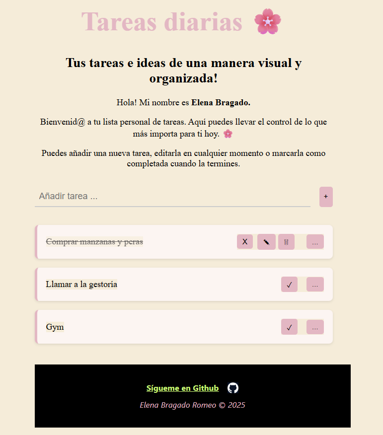

# 🌸 My Daily Tasks — Tu lista de tareas personal 🌸

## 🖥️ Ver proyecto en vivo
Puedes probarla directamente aquí:  
👉 [MyDailyTasks - Lista diaria de tareas](https://romeoelena.github.io/MyDailyTasks_HTML-CSS-JS/)

---

## 📝 Descripción

**My Daily Tasks** es una aplicación web desarrollada con **HTML, CSS y JavaScript puro**, creada para ayudarte a organizar tus tareas diarias de una manera visual, clara y sencilla.  

El usuario puede **añadir**, **editar**, **eliminar** o **marcar como completadas** sus tareas, manteniendo un registro dinámico y personalizado.  
Su diseño minimalista y elegante busca transmitir calma, organización y una experiencia agradable de uso.

---

## ✨ Funcionalidades principales

🌷 Añadir nuevas tareas  
🖋️ Editar tareas existentes  
❌ Eliminar tareas  
✅ Marcar tareas como completadas  
💾 Guardado automático con **LocalStorage**  
🎨 Interfaz intuitiva, minimalista y responsive  

---

## 🛠️ Tecnologías utilizadas

| 💻 Tecnología | 🌿 Descripción |
|---------------|----------------|
| **HTML5** | Estructura del contenido |
| **CSS3** | Diseño visual, colores y maquetación |
| **JavaScript (ES6)** | Lógica y funcionalidad interactiva |
| **LocalStorage API** | Almacenamiento de tareas en el navegador |

---

## 🎯 Objetivo del proyecto

Este proyecto forma parte de mi desarrollo como **Front-End Developer**, y tiene como propósito practicar:

- Manipulación dinámica del DOM  
- Gestión de eventos con JavaScript  
- Persistencia de datos en el navegador  
- Creación de interfaces funcionales y agradables a la vista  

Además, refleja mi interés por crear herramientas **útiles, bonitas y accesibles**, que faciliten la organización personal.

---
## ✨ Vista previa

---

## 👩‍💻 Autora

**Elena Bragado Romeo**  
Desarrolladora Web • Creativa • Orientada a resultados  

🔗 [GitHub](https://github.com/romeoelena)

> “Organiza tu día, libera tu mente y deja espacio para lo que realmente importa.” 🌼

---

⭐ *Si te ha gustado este proyecto, no dudes en dejar una estrella en el repositorio. ¡Gracias por visitar!*  
